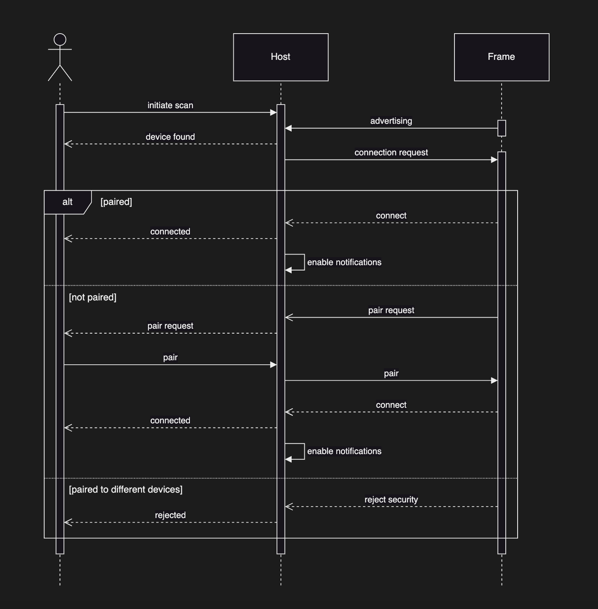

# Halo Bluetooth Protocol Specification

## 1. Basic Interface Definition

**Device Naming Convention:**  
Devices are named as `Halo XX`, where `XX` represents the 4th byte (in hex) of the device's EUI-48 MAC address.

### 1.1 Device-Side Interface Composition

- **LUA + USERDATA Command Interface:** Bidirectional communication (TX/RX) → High priority
- **Audio Stream Interface:** Stream audio to Halo speaker (RX) → Medium priority  

---

## 2. Protocol Interaction Logic

### 2.1 MTU Packet Aggregation Format

The app and device must automatically fragment and reassemble data based on the negotiated MTU size. If the user sends data via the USERDATA command channel, the user is responsible for fragmentation and reassembly.

### 2.2 Command Channel Format

- **Mobile Request Format:** Lua command  
- **Device Response Format:** Execution result  

### 2.3 Media Stream Format

- **Audio Stream:** LC3 encoding, PCM RAW data, or (bidirectional) LE Audio (format determined by API configuration)  

---

## 3. Protocol Specification

The device implements multiple Bluetooth services for different functionalities.

### 3.1 Halo Lua Service

**Service UUID:** `7A230001-5475-A6A4-654C-8431F6AD49C4`

#### 3.1.1 Characteristic List

| Characteristic | UUID | Permissions | Size |
|----------------|------|-------------|------|
| LUA RX | `7A230002-5475-A6A4-654C-8431F6AD49C4` | Write Without Response, Write | MTU (512) |
| LUA TX | `7A230003-5475-A6A4-654C-8431F6AD49C4` | Notify | MTU (512) |
| AUDIO RX | `7A230005-5475-A6A4-654C-8431F6AD49C4` | Write Without Response, Write | MTU (512) |

The LUA parser channel consists of **LUA TX** and **LUA RX**, forming a full-duplex communication channel designed to support a complete LUA REPL (Read-Eval-Print Loop).

##### 3.1.2 Command Format

| Command Header | Payload | Function |
|----------------|---------|----------|
| `0x01` | User data | Data transfer marker (first byte for data channel) |
| `0x02` | None | CTRL+B (Reboot device) |
| `0x03` | None | CTRL+C (Interrupt script execution) |
| `0x04` | None | CTRL+D (Restart Lua runtime) |
| `0x05` | None | CTRL+E (Reset and remove `main.lua`) |
| `0x06` | None | CTRL+F (Exit Lua runtime completely) |
| `0x07` | None | CTRL+G (Remove all files/folders, except settings) |

##### 3.1.3 Audio Channel

The audio channel supports multiple formats:
- **LC3 Encoding:** Frame rate: 10ms per frame, Example: 16kHz, 16-bit, Mono, 16kbps audio
- **PCM Encoding:** Raw PCM data format
- **LE Audio:** Bluetooth LE Audio Unicast (BAP) with codec negotiation

**LE Audio precedence:** The device also exposes its microphone and speakers as standard LE Audio endpoints (BAP Unicast Server with source and sink ASEs, plus MICS/VCS controls — see `BLE_SERVICES.md`). When the connected host establishes an LE Audio stream, it takes priority over the custom channel: an active `frame.microphone` capture is preempted (subsequent `frame.microphone.read()` raises an error and `frame.microphone.start()` fails until the host releases the stream), matching the existing speaker behavior. Use `frame.microphone.status()` to detect this state.

### 3.2 Battery Service

**Service UUID:** `0x180F` (Standard BLE Battery Service)

| Characteristic | UUID | Permissions | Description |
|----------------|------|-------------|-------------|
| Battery Level | `0x2A19` | Read, Notify | Battery level (0-100%) |

### 3.3 OTA Service

**Service UUID:** `8D53DC1D-1DB7-4CD3-868B-8A527460AA84`

Implements SMP (Simple Management Protocol) over BLE for firmware updates.

| Characteristic | UUID | Permissions | Description |
|----------------|------|-------------|-------------|
| SMP | `DA2E7828-FBCE-4E01-AE9E-261174997C48` | Write Without Response, Write, Notify | Firmware update control |

---

## 4. Pairing Process

The device advertises its name (`Halo XX`) and the Halo Lua Service UUID
(`7a230001-5475-a6a4-654c-8431f6ad49c4`). The scan response carries the
appearance (Eye-glasses), the Battery Service UUID (`180f`), an ANCS service
solicitation for iOS, and LE Audio announcements as space permits (see
`BLE_SERVICES.md`).

The app scans for the Lua Service UUID and automatically connects to the
nearest device. The device stores up to **5 bonds** (LRU-evicted) and accepts
one connection at a time — see `PAIRING.md` for the full model. Upon receiving
a connection request:
- If the peer matches a stored bond, the connection is established and encrypted.
- If the peer is unknown, it is accepted and paired only while the pairing
  window is open (5 s button hold, ~60 s window) or while no bonds exist yet
  (out-of-box); otherwise it is disconnected.



---

## 5. Script Upgrade

Refer to the **LUA API File** section.

---

## 6. Firmware Upgrade

Firmware updates use the **MCU-BOOT** scheme.

- [GitHub - alifsemi/mcuboot_alif: MCUboot port for Alif Semiconductor devices](https://github.com/alifsemi/mcuboot_alif)
- [mcuboot_alif/docs/readme-zephyr.md at main · alifsemi/mcuboot_alif](https://github.com/alifsemi/mcuboot_alif/blob/main/docs/readme-zephyr.md)

---

## 7. LUA API

This firmware provides a subset of standard Lua functions and Halo-specific APIs.

**Notation:**
- `[]`: Optional
- `<>`: Required

---

### 7.1 System

System-level service APIs.

| Function Name | Parameters | Return Value | Description |
|---------------|------------|--------------|-------------|
| `HARDWARE_VERSION` | None | `string` | Get hardware version info (constant) |
| `FIRMWARE_VERSION` | None | `string` | Get firmware version info (constant) |
| `GIT_TAG` | None | `string` | Get build version info (constant) |
| `SE_REVISION` | None | `string` | Get Secure Enclave firmware revision (constant) |
| `get_se_revision()` | None | `string` | Get Secure Enclave firmware revision (lazy loaded) |
| `sleep([seconds])` | `[seconds: number]` | `nil` | Sleep or enter deep sleep |
| `light_sleep([seconds])` | `[seconds: number]` | `nil` | Enter light sleep mode |
| `standby([seconds])` | `[seconds: number]` | `nil` | Enter standby sleep mode |
| `yield()` | None | `nil` | Yield execution to other tasks |
| `stay_awake([enabled])` | `[enabled: boolean]` | `boolean/nil` | Control system wake state |
| `reboot()` | None | None | Reboot the system |
| `battery_level()` | None | `number` | Get battery level (0–100) |
| `battery_voltage()` | None | `number` | Get battery voltage (mV) |
| `battery_charging()` | None | `boolean` | Check if battery is charging |
| `ship_mode()` | None | None | Enter ship mode (ultra-low power) |
| `charge([enable])` | `[enable: boolean]` | `nil` | Control battery charging |
| `wakeup_source()` | None | `string` | Get wakeup source |
| `get_eui()` | None | `string` | Get device EUI-64 address |

#### `frame.HARDWARE_VERSION`

- **Parameters:** None
- **Returns:** `string` (e.g., `"halo"`)
- **Example:**
  ```lua
  print(frame.HARDWARE_VERSION)
  -- Output: halo
  ```

#### `frame.FIRMWARE_VERSION`

- **Parameters:** None
- **Returns:** `string` (e.g., `"0.8.8"`)
- **Example:**
  ```lua
  print(frame.FIRMWARE_VERSION)
  -- Output: 0.8.8
  ```

#### `frame.GIT_TAG`

- **Parameters:** None
- **Returns:** `string` (e.g., `"c3b76c2212a7"`)
- **Example:**
  ```lua
  print(frame.GIT_TAG)
  -- Output: c3b76c2212a7
  ```

#### `frame.SE_REVISION`

- **Parameters:** None
- **Returns:** `string` - Secure Enclave firmware revision
- **Example:**
  ```lua
  print(frame.SE_REVISION)
  -- Output: SE firmware revision string
  ```

#### `frame.get_se_revision()`

- **Parameters:** None
- **Returns:** `string` - Secure Enclave firmware revision (lazy loaded)
- **Example:**
  ```lua
  print(frame.get_se_revision())
  -- Output: SE firmware revision string
  ```

#### `frame.sleep([seconds])`

Enters deep sleep mode. In deep sleep mode, all peripherals are powered off, Bluetooth connection is closed, and upon wakeup the system behaves as if it has been rebooted.

- **Parameters:**
  - `[seconds: number]`: Duration in seconds. Omitting this parameter triggers deep sleep.
- **Returns:** `nil`
- **Example:**
  ```lua
  -- Sleep for 5 seconds
  frame.sleep(5)
  
  -- Enter deep sleep/shutdown
  frame.sleep()
  ```

#### `frame.stay_awake([enabled])`

Controls whether the system stays awake.

- **Parameters:**
  - `[enabled: boolean]`:
    - `true`: Prevents sleep
    - `false`: Allows sleep
- **Returns:** `nil`
- **Example:**
  ```lua
  -- Prevent system from sleeping
  frame.stay_awake(true)
  
  -- Allow system to sleep
  frame.stay_awake(false)
  
  -- Get current wake state
  local awake = frame.stay_awake()
  ```

#### `frame.battery_level()`

Retrieves current battery level.

- **Parameters:** None
- **Returns:** `number` (0–100)
- **Example:**
  ```lua
  local battery = frame.battery_level()
  print("Battery level: " .. battery .. "%")
  ```

#### `frame.battery_voltage()`

Retrieves current battery voltage in millivolts.

- **Parameters:** None
- **Returns:** `number` (battery voltage in mV)
- **Example:**
  ```lua
  local voltage = frame.battery_voltage()
  print("Battery voltage: " .. voltage .. " mV")
  ```

#### `frame.battery_charging()`

Checks if the battery is currently charging.

- **Parameters:** None
- **Returns:** `boolean` (true if charging, false otherwise)
- **Example:**
  ```lua
  if frame.battery_charging() then
      print("Battery is charging")
  else
      print("Battery not charging")
  end
  ```

#### `frame.ship_mode()`

Enters ship mode (ultra-low power shutdown). Device can only be woken up by hardware reset or power cycle. This is typically used for long-term storage or shipping.

**WARNING:** After calling this function, the device will be completely powered down and will require a hardware reset to wake up!

- **Parameters:** None
- **Returns:** None (does not return if successful)
- **Example:**
  ```lua
  frame.ship_mode()
  ```

#### `frame.standby([seconds])`

Enters standby sleep mode for the specified duration. In standby mode, all peripherals are powered off, Bluetooth connection is maintained, and the Lua runtime is suspended. Upon wakeup, the system resumes from the state before sleep.

- **Parameters:**
  - `[seconds: number]`: Duration in seconds. If omitted or 0, sleeps indefinitely until wakeup event.
- **Returns:** `nil`
- **Example:**
  ```lua
  -- Standby for 30 seconds
  frame.standby(30)
  
  -- Standby indefinitely
  frame.standby()
  ```

#### `frame.charge([enable])`

Controls battery charging enable/disable.

- **Parameters:**
  - `[enable: boolean]`: 
    - `true`: Enable charging (default)
    - `false`: Disable charging
- **Returns:** `nil`
- **Example:**
  ```lua
  -- Enable charging
  frame.charge(true)
  
  -- Disable charging
  frame.charge(false)
  ```

#### `frame.wakeup_source()`

Get the source that woke the device from sleep.

- **Parameters:** None
- **Returns:** `string` representing the wakeup source:
  - `"unknown"` - Unknown wakeup source
  - `"timeout"` - Wakeup by timeout
  - `"button"` - Wakeup by button press
  - `"ble"` - Wakeup by BLE data
  - `"imu"` - Wakeup by IMU interrupt
  - `"microphone"` - Wakeup by microphone interrupt
- **Example:**
  ```lua
  local source = frame.wakeup_source()
  print("Woke up from: " .. source)
  ```

#### `frame.get_eui()`

Get the device EUI-64 address.

- **Parameters:** None
- **Returns:** `string` - 16-character hexadecimal string representing the 8-byte EUI-64 address
- **Example:**
  ```lua
  local eui = frame.get_eui()
  print("Device EUI: " .. eui)
  ```

#### `frame.light_sleep([seconds])`

Enters light sleep mode for the specified duration. In light sleep mode, all peripherals are powered off and the Bluetooth connection is maintained. On wakeup the Lua VM restarts and `main.lua` runs from the top — nothing after the `light_sleep()` call executes. Read `frame.wakeup_source()` at the top of the script to learn why it is running. (`frame.standby()` is the mode that resumes in place.)

- **Parameters:**
  - `[seconds: number]`: Duration in seconds. If omitted or 0, sleeps indefinitely until wakeup event.
- **Returns:** `nil`
- **Example:**
  ```lua
  -- Light sleep for 10 seconds
  frame.light_sleep(10)
  
  -- Light sleep indefinitely
  frame.light_sleep()
  ```

#### `frame.yield()`

Yields execution to allow other tasks to run. Useful in long-running loops to maintain system responsiveness.

- **Parameters:** None
- **Returns:** `nil`
- **Example:**
  ```lua
  while true do
      -- Do some work
      process_data()
      -- Yield to other tasks
      frame.yield()
  end
  ```

#### `frame.reboot()`

Reboots the system immediately.

- **Parameters:** None
- **Returns:** None (does not return)
- **Example:**
  ```lua
  frame.reboot()
  ```

---

### 7.2 Time

Time module APIs.

| Function Name | Parameters | Return Value | Description |
|---------------|------------|--------------|-------------|
| `time.utc([timestamp])` | `[timestamp: number]` | `number` | Get or set UTC timestamp (seconds) |
| `time.zone([offset])` | `[offset: string]` | `string` | Get or set timezone offset (±hh:mm) |
| `time.date([timestamp])` | `[timestamp: number]` | `table` | Get detailed time structure |

#### `frame.time.utc([timestamp])`

Get or set UTC time.

Without arguments: returns current UTC timestamp in seconds.
With argument: sets UTC time from Unix timestamp (seconds).

If UTC time was never explicitly set, the function returns uptime in seconds (system boot time is treated as epoch 0).

- **Parameters:**
  - `[timestamp: number]`: UTC timestamp in seconds (optional)
- **Returns:**
  - `number`: Current UTC timestamp in seconds (when getting)
- **Errors:**
  - Throws an error if timestamp is negative
- **Example:**
  ```lua
  -- Get current UTC time
  print(frame.time.utc())
  
  -- Set UTC time to 2024-06-15 00:00:00
  frame.time.utc(1718438400)
  ```

#### `frame.time.zone([offset])`

Get or set timezone offset.

Without arguments: returns current time zone as string (e.g., "+08:00").
With argument: sets time zone from string (e.g., "+08:00", "-05:30") and
returns the stored zone in the same normalised format.

- **Parameters:**
  - `[offset: string]`: Timezone in format `±hh:mm` (e.g., `"+08:00"`) (optional)
- **Returns:**
  - `string`: Current timezone (when getting *and* when setting)
- **Errors:**
  - Throws an error if time zone format is invalid
  - Throws an error if hour is not between -12 and +14
  - Throws an error if minute is not 0, 30, or 45
  - Throws an error if UTC-12 or UTC+14 has non-zero minutes
- **Rules:**
  - Hours: -12 to +14
  - Minutes: only 00, 30, 45
  - For UTC-12 and UTC+14, minutes must be 00
- **Example:**
  ```lua
  -- Get current timezone
  print(frame.time.zone())
  
  -- Set to UTC+8
  frame.time.zone("+08:00")
  
  -- Set to UTC-5:30
  frame.time.zone("-05:30")
  ```

#### `frame.time.date([timestamp])`

Get local date/time as a table.

Without arguments: returns current local time (or uptime + timezone if UTC never set).
With argument: converts Unix timestamp to local time.

The returned table contains the following fields:
- `second`: Seconds (0-59)
- `minute`: Minutes (0-59)
- `hour`: Hours (0-23)
- `day`: Day of month (1-31)
- `month`: Month (1-12)
- `year`: Full year (e.g., 2025)
- `weekday`: Day of week (0-6, where 0=Sunday)
- `day of year`: Day of year (0-365)
- `is daylight saving`: Daylight saving time flag (boolean)

- **Parameters:**
  - `[timestamp: number]`: UTC timestamp in seconds (optional)
- **Returns:** `table` with date/time components
- **Errors:**
  - Throws an error if timestamp is negative
- **Example:**
  ```lua
  -- Get current local time
  local now = frame.time.date()
  print(string.format("%04d-%02d-%02d %02d:%02d:%02d", 
      now.year, now.month, now.day, now.hour, now.minute, now.second))
  
  -- Convert timestamp to local time
  local t = frame.time.date(1718438400)
  print(t.year, t.month, t.day)
  
  -- Access individual components
  local date = frame.time.date()
  print("Day of week:", date.weekday)
  print("Day of year:", date["day of year"])
  ```

---

### 7.3 File

File system module APIs.

| Function Name | Parameters | Return Value | Description |
|---------------|------------|--------------|-------------|
| `file.open(filename, [mode])` | `<filename: string>`, `[mode: string]` | `file_handle` | Open file (r/w/a) |
| `file.remove(filename)` | `<filename: string>` | `nil` | Delete file/directory |
| `file.remove_all()` | None | `nil` | Remove all files/folders (except settings) |
| `file.rename(old_name, new_name)` | `<old_name: string>`, `<new_name: string>` | `nil` | Rename file/directory |
| `file.listdir(path)` | `<path: string>` | `table` | List directory contents |
| `file.mkdir(path)` | `<path: string>` | `nil` | Create directory |

#### `frame.file.open(<filename>, [mode])`

Opens a file with specified mode.

Files are stored in the LittleFS file system mounted at `/lfs/`. All file paths are relative to this mount point.

- **Parameters:**
  - `<filename: string>`: File path (e.g., `"main.lua"`)
  - `[mode: string]`: `"r"` (read), `"w"` (write/truncate), `"a"` (append). Default: `"r"`
- **Returns:** `file_handle` with methods:
  - `:read()`: Read a line (returns string or nil on EOF)
  - `:write(string)`: Write text to file
  - `:close()`: Close file
- **Errors:**
  - Throws an error if file cannot be opened
  - Throws an error if mode is invalid
  - Throws an error if filename is too long
- **Example:**
  ```lua
  -- Write to file
  local f = frame.file.open("test.txt", "w")
  f:write("Hello World\n")
  f:close()
  
  -- Read from file
  local f = frame.file.open("test.txt", "r")
  local content = f:read()
  print(content)
  f:close()
  
  -- Append to file
  local f = frame.file.open("log.txt", "a")
  f:write("New log entry\n")
  f:close()
  ```

#### `frame.file.remove(<filename>)`

Deletes a file or empty directory.

- **Parameters:** `<filename: string>`: Path to file or directory
- **Returns:** `nil`
- **Errors:**
  - Throws an error if file/directory cannot be removed
  - Throws an error if filename is too long
- **Example:**
  ```lua
  -- Remove a file
  frame.file.remove("test.txt")
  
  -- Remove an empty directory
  frame.file.remove("mydir")
  ```

#### `frame.file.rename(<old_name>, <new_name>)`

Renames a file or directory.

- **Parameters:**
  - `<old_name: string>`: Current name
  - `<new_name: string>`: New name
- **Returns:** `nil`
- **Errors:**
  - Throws an error if source file/directory not found
  - Throws an error if destination already exists
  - Throws an error if either filename is too long
- **Example:**
  ```lua
  frame.file.rename("old.txt", "new.txt")
  frame.file.rename("data", "backup")
  ```

#### `frame.file.listdir(<path>)`

Lists contents of a directory.

Returns an array of tables, each representing a file or directory entry.

- **Parameters:** `<path: string>`: Directory path
- **Returns:** `table` of entries with:
  - `name: string` - Entry name
  - `size: number` - Size in bytes (0 for directories)
  - `type: number` - Entry type (1=file, 2=directory)
- **Errors:**
  - Throws an error if directory not found
  - Throws an error if path is too long
  - Throws an error if directory cannot be read
- **Example:**
  ```lua
  -- List root directory
  local list = frame.file.listdir("")
  for i, item in ipairs(list) do
      local type_str = item.type == 1 and "file" or "dir"
      print(item.name, item.size, type_str)
  end
  
  -- List specific directory
  local subdir = frame.file.listdir("data")
  ```

#### `frame.file.mkdir(<path>)`

Creates a directory, supporting recursive creation of parent directories.

- **Parameters:** `<path: string>`: Directory path to create
- **Returns:** `nil`
- **Errors:**
  - Throws an error if path is too long
  - Throws an error if directory cannot be created
- **Example:**
  ```lua
  -- Create a single directory
  frame.file.mkdir("data")
  
  -- Create nested directories
  frame.file.mkdir("data/logs/2025")
  ```

#### `frame.file.remove_all()`

Removes all files and folders from the file system to free up storage space. The settings file (`/lfs/settings`) containing pairing information and configuration is preserved.

- **Parameters:** None
- **Returns:** `nil`
- **Errors:**
  - Throws an error if file system operation fails
- **Example:**
  ```lua
  -- Remove all user files and folders
  frame.file.remove_all()

  -- Settings file is preserved, so pairing info and config remain intact
  ```

**Note:** The global `require()` function is overridden to load modules from the file system instead of using the standard Lua `require`. Modules are loaded from `/lfs/<module_name>.lua`.

```lua
-- Load a module from /lfs/mymodule.lua
local mymodule = require("mymodule")
```

---

### 7.4 Button

Button event APIs.

| Function Name | Parameters | Return Value | Description |
|---------------|------------|--------------|-------------|
| `button.single(func)` | `<func: function/nil>` | `nil` | Set/clear single-click callback |
| `button.double(func)` | `<func: function/nil>` | `nil` | Set/clear double-click callback |
| `button.long(func)` | `<func: function/nil>` | `nil` | Set/clear long-press callback |

#### `frame.button.single(func)`

Sets or clears the single-click callback.

When the button is pressed and released quickly, this callback is triggered.

- **Parameters:**
  - `<func: function>`: Callback function to execute on single click
  - `nil`: Clears the callback
- **Returns:** `nil`
- **Errors:**
  - Throws an error if func is not a function or nil
- **Example:**
  ```lua
  frame.button.single(function()
      print("Single click detected")
  end)
  
  -- Clear callback
  frame.button.single(nil)
  ```

#### `frame.button.double(func)`

Sets or clears the double-click callback.

When the button is pressed and released twice quickly, this callback is triggered.

- **Parameters:**
  - `<func: function>`: Callback function to execute on double click
  - `nil`: Clears the callback
- **Returns:** `nil`
- **Errors:**
  - Throws an error if func is not a function or nil
- **Example:**
  ```lua
  frame.button.double(function()
      print("Double click detected")
  end)
  
  -- Clear callback
  frame.button.double(nil)
  ```

#### `frame.button.long(func)`

Sets or clears the long-press callback.

Triggered when the button is held for 1 second and released before the
2-second power-off threshold.

Longer holds are firmware-reserved (see `BUTTON_LED_GUIDE.md`):
- **2 s** — a short beep marks the threshold; releasing then enters deep sleep
- **5 s** — opens the Bluetooth pairing window, marked by a coin chime (keep holding through the 2 s beep)
- **15 s** — ship mode: factory reset + full shutdown

- **Parameters:**
  - `<func: function>`: Callback function to execute on long press
  - `nil`: Clears the callback
- **Returns:** `nil`
- **Errors:**
  - Throws an error if func is not a function or nil
- **Example:**
  ```lua
  frame.button.long(function()
      print("Long press detected")
  end)
  
  -- Clear callback
  frame.button.long(nil)
  ```

---

### 7.5 Bluetooth

Bluetooth module APIs.

| Function Name | Parameters | Return Value | Description |
|---------------|------------|--------------|-------------|
| `bluetooth.is_connected()` | None | `boolean` | Check if connected |
| `bluetooth.address()` | None | `string` | Get MAC address |
| `bluetooth.max_length()` | None | `number` | Max send length |
| `bluetooth.send(data)` | `<data: string>` | None | Send data |
| `bluetooth.receive_callback(func)` | `<func: function/nil>` | `nil` | Set receive callback |

#### `frame.bluetooth.is_connected()`

Checks Bluetooth connection status.

- **Parameters:** None
- **Returns:** `boolean` - `true` if connected, `false` otherwise
- **Example:**
  ```lua
  if frame.bluetooth.is_connected() then
      print("Bluetooth connected")
  end
  ```

#### `frame.bluetooth.address()`

Gets the device's Bluetooth MAC address.

- **Parameters:** None
- **Returns:** `string` - MAC address in format `"XX:XX:XX:XX:XX:XX"`
- **Example:**
  ```lua
  print("MAC:", frame.bluetooth.address())
  ```

#### `frame.bluetooth.max_length()`

Gets maximum data length for send() operation. Returns MTU size minus 1 byte (used for internal marker).

- **Parameters:** None
- **Returns:** `number` - Maximum data length in bytes
- **Example:**
  ```lua
  print("Max length:", frame.bluetooth.max_length())
  ```

#### `frame.bluetooth.send(data)`

Sends a string over Bluetooth. Data is prefixed with a marker byte before transmission and supports fragmentation for large data packets.

Note: sending an **empty string transmits nothing** and still returns success —
an end-of-stream marker must be a non-empty payload (e.g. a single byte).

- **Parameters:** `<data: string>` - Data to send (length ≤ `max_length()`)
- **Returns:** `nil` on success, throws error on failure
- **Errors:**
  - Throws an error if not connected
  - Throws an error if MTU size is invalid
  - Throws an error if send fails
- **Example:**
  ```lua
  frame.bluetooth.send("Hello BLE")
  ```

#### `frame.bluetooth.receive_callback(func)`

Registers or clears data receive callback.
- Pass a function to register callback
- Pass `nil` to clear callback

- **Parameters:**
  - `<func: function>`: Function with signature `function(data)` or `nil` to clear
- **Returns:** `nil`
- **Errors:**
  - Throws an error if func is not a function or nil
- **Example:**
  ```lua
  frame.bluetooth.receive_callback(function(data)
      print("Received:", data)
  end)
  
  -- Clear callback
  frame.bluetooth.receive_callback(nil)
  ```

---

### 7.6 IMU

IMU (Inertial Measurement Unit) APIs.

| Function Name | Parameters | Return Value | Description |
|---------------|------------|--------------|-------------|
| `imu.tap_callback(func)` | `<func: function/nil>` | `nil` | Set tap detection callback |
| `imu.tap_config([options])` | `<options: table/nil>` | `nil` or `table` | Tune / read the tap detector |
| `imu.direction()` | None | `table` | Get pitch/roll/heading |
| `imu.raw()` | None | `table` | Get raw accelerometer & magnetometer data |
| `imu.config(options)` | `<options: table>` | `nil` | Configure sensor parameters |

#### `frame.imu.tap_callback(func)`

Registers or clears the tap detection callback. The callback fires on
hardware-detected **single, double and triple** taps and receives the gesture
kind as its argument: `'single'`, `'double'` or `'triple'` (handlers that take
no argument keep working — Lua ignores extra arguments).

The detector confirms a gesture only after the multi-tap window expires
(`wait_for_timeout`), so a single tap that turns out to be the first tap of a
double does **not** fire `'single'` first — each physical gesture produces
exactly one callback. The trade-off is that a single tap is reported roughly
one gesture window after the tap.

- **Parameters:**
  - `<func: function>`: Function called as `func(kind)` on each detected
    gesture, or `nil` to clear the callback
- **Returns:** `nil`
- **Errors:**
  - Throws an error if IMU is not initialized
  - Throws an error if func is not a function or nil
  - Throws an error if the hardware tap trigger could not be armed (a
    registered callback would otherwise silently never fire)
- **Example:**
  ```lua
  frame.imu.tap_callback(function(kind)
      if kind == 'double' then
          print("Double tap!")
      end
  end)

  -- Clear callback
  frame.imu.tap_callback(nil)
  ```

#### `frame.imu.tap_config([options])`

Tunes the hardware tap detector, or reads the current configuration when
called with no argument. Settings apply immediately (the detector re-arms) and
reset to the defaults below on reboot.

The defaults were tuned on a worn production device: reliable temple taps,
ordinary table set-downs rejected (a very firm set-down can still register —
it is physically a tap). Multi-tap gestures want deliberate, crisp taps; an
app that only listens for e.g. `'double'` may relax `threshold` for easier
gestures at the cost of more spurious singles.

- **Parameters:**
  - `<options: table>` (each field optional; unlisted fields keep their value):
    - `mode`: `'sensitive'` | `'normal'` | `'robust'` — detection strictness
      (default `'normal'`)
    - `axis`: `'x'` | `'y'` | `'z'` — the **single** dominant axis the
      detector watches (hardware limitation; default `'z'`, the worn
      temple-tap axis — device gravity sits on X when worn)
    - `threshold`: minimum tap peak, 0–1023 raw units (default `200`;
      lower = lighter taps register)
    - `gesture_duration`: window after the first tap for the 2nd/3rd,
      0–63 (default `30`)
    - `wait_for_timeout`: boolean — confirm gestures only after the window
      expires; disabling reports singles immediately but a double then also
      fires `'single'` (default `true`)
    - `max_peaks`: threshold crossings tolerated around one tap, 0–7
      (default `6`)
    - `peak_duration` (0–15, default `4`), `shock_duration` (0–15, default
      `6`), `quiet_between_taps` (0–15, default `8`), `quiet_after_gesture`
      (0–15, default `6`): raw-unit shock/quiet timings; see the BMA580
      datasheet
- **Returns:** `nil` when setting; the full configuration table when called
  with no argument
- **Errors:**
  - Throws an error if IMU is not initialized
  - Throws an error on an unknown `mode`/`axis` or an out-of-range value
- **Example:**
  ```lua
  frame.imu.tap_config({ threshold = 150 })   -- easier multi-taps
  print(frame.imu.tap_config().mode)          -- 'normal'
  ```

#### `frame.imu.direction()`

Gets current device orientation as pitch, roll, and heading angles.

- **Parameters:** None
- **Returns:** `table` with the following fields:
  - `pitch`: Pitch angle in degrees (rotation around X-axis)
  - `roll`: Roll angle in degrees (rotation around Y-axis)
  - `heading`: Always `0.0` — kept for Frame API compatibility. A meaningful
    compass heading needs host-side calibration (per-unit hard-iron tumble,
    mag/accel alignment, local declination); compute it on the host from
    `frame.imu.raw()` — see the SDK's `imu_compass` example
- **Errors:**
  - Throws an error if IMU is not initialized
  - Throws an error if failed to initialize IMU hardware
  - Throws an error if failed to fetch accelerometer data
- **Example:**
  ```lua
  local o = frame.imu.direction()
  print("Pitch:", o.pitch, "Roll:", o.roll, "Heading:", o.heading)
  ```

#### `frame.imu.raw()`

Gets raw sensor data from accelerometer and magnetometer.

- **Parameters:** None
- **Returns:** `table` with the following structure:
  ```lua
  {
    compass = { x = number, y = number, z = number }, -- μT (micro-Tesla)
    accelerometer = { x = number, y = number, z = number } -- mg (milli-g)
  }
  ```
- **Errors:**
  - Throws an error if IMU is not initialized
  - Throws an error if failed to initialize IMU hardware
  - Throws an error if failed to fetch sensor data
- **Example:**
  ```lua
  local data = frame.imu.raw()
  print("Accel X:", data.accelerometer.x, "mg")
  print("Compass Z:", data.compass.z, "μT")
  ```

#### `frame.imu.config(options)`

Configures IMU sensor parameters including sampling frequency and full scale range.

- **Parameters:**
  - `<options: table>`: Configuration options with the following structure:
    ```lua
    {
      accelerometer = {
        sampling_frequency = number,  -- Hz (optional)
        full_scale = number          -- g (optional)
      },
      magnetometer = {
        sampling_frequency = number,  -- Hz (optional)
        full_scale = number          -- Gauss (optional)
      }
    }
    ```
- **Returns:** `nil`
- **Errors:**
  - Throws an error if IMU is not initialized
  - Throws an error if failed to initialize IMU hardware
  - Throws an error if failed to set sensor attributes
- **Example:**
  ```lua
  -- Configure accelerometer and magnetometer
  frame.imu.config({
      accelerometer = {
          sampling_frequency = 200,  -- 200 Hz
          full_scale = 16            -- ±16g
      },
      magnetometer = {
          sampling_frequency = 100,  -- 100 Hz
          full_scale = 4             -- ±4 Gauss
      }
  })
  ```

---

### 7.7 Compression

LZ4 decompression module.

| Function Name | Parameters | Return Value | Description |
|---------------|------------|--------------|-------------|
| `compression.decompress(data, block_size)` | `<data: string>, <block_size: number>` | `nil` | Decompress LZ4 data |
| `compression.process_function(func)` | `<func: function/nil>` | `nil` | Set decompressed data callback |

#### `frame.compression.process_function(func)`

Registers or clears callback function for processing decompressed data blocks.

Each time a block of data is decompressed, the callback function is invoked with the decompressed data as a parameter.

- **Parameters:**
  - `<func: function>`: Function that takes one parameter (decompressed data string), or `nil` to clear callback
- **Returns:** `nil`
- **Errors:**
  - Throws an error if func is not a function or nil
- **Example:**
  ```lua
  -- Register callback to process decompressed data
  frame.compression.process_function(function(data)
      print("Decompressed block:", #data, "bytes")
      -- Process the decompressed data
      local file = frame.file.open("output.bin", "a")
      file:write(data)
      file:close()
  end)
  
  -- Clear callback
  frame.compression.process_function(nil)
  ```

#### `frame.compression.decompress(data, block_size)`

Decompresses LZ4 compressed data in blocks.

The function processes the compressed data and invokes the registered process_function callback for each decompressed block. The block_size parameter determines the maximum size of each decompressed block.

- **Parameters:**
  - `<data: string>`: LZ4 compressed data to decompress
  - `<block_size: number>`: Maximum size of each decompressed block in bytes (must be between 1 and 1048576)
- **Returns:** `nil`
- **Errors:**
  - Throws an error if block_size is not greater than 0
  - Throws an error if block_size is too large (maximum 1MB)
  - Throws an error if no process_function is registered
  - Throws an error if decompression fails
- **Example:**
  ```lua
  -- Register callback first
  frame.compression.process_function(function(data)
      print("Received", #data, "bytes of decompressed data")
  end)
  
  -- Decompress data
  frame.compression.decompress(compressed_data, 4096)  -- 4KB blocks
  ```

---

### 7.8 Speaker

Audio playback module supporting PCM and LC3.

| Function Name | Parameters | Return Value | Description |
|---------------|------------|--------------|-------------|
| `speaker.start(cfg)` | `<cfg: table>` | `nil` | Initialize speaker |
| `speaker.play(data)` | `<data: string>` | `nil` | Play audio data |
| `speaker.volume([val])` | `[val: number]` | `number` | Get or set volume (0–100) |
| `speaker.stop()` | None | `nil` | Stop playback |

#### `frame.speaker.start(cfg)`

Initializes the speaker.

- **Parameters (`cfg` table):**
  | Field | Type | Default | Description |
  |-------|------|---------|-------------|
  | `encoder` | string | `"pcm"` | `"pcm"` or `"lc3"` |
  | `sample_rate` | number | 8000 | 8000 or 16000 Hz |
  | `channels` | number | 1 | 1 (mono) or 2 (stereo) |
  | `bit_depth` | number | 16 | 16 bits (PCM only, 8-bit not supported) |
  | `duration` | number | 1000 | LC3 frame duration (µs/10, matching the Alif LC3 enum: 750 = 7.5 ms, 1000 = 10 ms) |
  | `bitrate` | number | 16000 | LC3 bitrate (multiple of 8000, ≤96000) |
  | `volume` | number | 50 | Volume (0–100%) |

- **Returns:** `nil`
- **Errors:**
  - Throws an error if cfg is not a table
  - Throws an error if sample_rate is not 8000 or 16000
  - Throws an error if channels is not 1 or 2
  - Throws an error if bit_depth is not 16
  - Throws an error if encoder is "lc3" and duration is not 750 or 1000
  - Throws an error if encoder is "lc3" and bitrate is not a multiple of 8000 or > 96000
  - Throws an error if volume is not 0-100
  - Throws an error if speaker initialization fails
  - Throws an error if LC3 decoder creation fails
  - Throws an error if memory allocation fails
- **Example:**
  ```lua
  -- Start speaker with PCM format
  frame.speaker.start({
      encoder = "pcm",
      sample_rate = 16000,
      channels = 1,
      volume = 80
  })
  
  -- Start speaker with LC3 format
  frame.speaker.start({
      encoder = "lc3",
      sample_rate = 16000,
      channels = 2,
      duration = 1000,
      bitrate = 32000,
      volume = 80
  })
  
  -- Reconfigure speaker (will stop and restart)
  frame.speaker.start({
      encoder = "lc3",
      sample_rate = 8000,
      channels = 1,
      duration = 750,
      bitrate = 16000,
      volume = 50
  })
  ```

#### `frame.speaker.play(data)`

Plays audio data directly (bypassing BLE streaming thread).

- **Parameters:** `<data: string>` (binary audio data)
- **Returns:** `nil`
- **Errors:**
  - Throws an error if speaker is not started
  - Throws an error if data is not a string
  - Throws an error if encoder is "lc3" and data size is invalid
  - Throws an error if LC3 decoding fails
- **Example:**
  ```lua
  -- Play PCM data directly
  local pcm_data = get_pcm_audio_data()
  frame.speaker.play(pcm_data)
  
  -- Play LC3 data directly
  frame.speaker.start({
      encoder = "lc3",
      sample_rate = 16000,
      duration = 1000,
      bitrate = 16000
  })
  local lc3_data = get_lc3_audio_data()
  frame.speaker.play(lc3_data)
  ```

#### `frame.speaker.volume([val])`

Gets or sets playback volume.

- **Parameters:**
  - `[val: number]` - Volume level (0–100). If not provided, returns current volume.
- **Returns:**
  - If getting (no argument): `number` - Current volume level
  - If setting (with argument): `nil`
- **Errors:**
  - Throws an error if val is provided and not 0-100
  - Throws an error if val is provided and speaker is not initialized
- **Example:**
  ```lua
  -- Get current volume (works without initialization)
  local vol = frame.speaker.volume()
  print("Current volume:", vol)

  -- Set volume (requires initialization)
  frame.speaker.start({sample_rate = 8000})
  frame.speaker.volume(60)
  ```

#### `frame.speaker.stop()`

Stops playback and cleans up resources.

- **Returns:** `nil`
- **Example:**
  ```lua
  frame.speaker.stop()
  ```

---

### 7.9 Microphone

Microphone recording module.

| Function Name | Parameters | Return Value | Description |
|---------------|------------|--------------|-------------|
| `microphone.start(cfg)` | `<cfg: table>` | `nil` | Initialize mic |
| `microphone.read(bytes)` | `<bytes: number>` | `string/nil` | Read audio data |
| `microphone.gain([val])` | `[val: number]` | `number/nil` | Get or set gain (-10 to 10) |
| `microphone.stop()` | None | `nil` | Stop recording |
| `microphone.status()` | None | `string` | Get microphone state (`"stopped"`, `"streaming"`, `"le_audio"`) |
| `microphone.aad_callback(func, [threshold], [silent_period])` | `<func: function/nil>, [threshold: number], [silent_period: number]` | `nil` | Set AAD callback |
| `microphone.aec([enable])` | `[enable: boolean]` | `boolean/nil` | Get or set on-device echo cancellation (Halo only) |
| `microphone.voice([enable])` | `[enable: boolean]` | `boolean/nil` | Get or set voice-band mode (Halo only) |
| `microphone.diag(cmd)` | `<cmd: string>` | `table/nil` | AEC diagnostics `"stats"`/`"zero"` (Halo only) |

#### `frame.microphone.start(cfg)`

Initializes the microphone.

- **Startup latency:** The DMIC driver captures audio in fixed-size blocks. The first `read()` cannot return audio until the first block is captured and written to the ring buffer. This occurs in normal run mode without `frame.standby()`. Standby/light sleep additionally stops the mic and clears the buffer, so the same startup delay applies again after wake. Firmware logs `Mic Lua start`, `Mic first ring put`, and `Mic first Lua read` for UART timing.

- **Parameters (`cfg` table):**
  | Field | Type | Default | Description |
  |-------|------|---------|-------------|
  | `encoder` | string | `"pcm"` | `"pcm"` or `"lc3"` |
  | `sample_rate` | number | 8000 | 8000 or 16000 Hz |
  | `bit_depth` | number | 16 | 8 or 16 (PCM only). Capture and processing always run at 16-bit; 8 selects signed 8-bit *output*, downconverted after the AEC/DC-block/voice stages (halves BLE bandwidth) |
  | `channels` | number | 1 | 1 (mono) or 2 (stereo) |
  | `duration` | number | 1000 | LC3 frame duration (µs/10, matching the Alif LC3 enum: 750 = 7.5 ms, 1000 = 10 ms) |
  | `bitrate` | number | 16000 | LC3 bitrate (multiple of 8000, ≤96000) |
  | `gain` | number | 0 | Gain (-10 to 10) |
  | `aec` | boolean | false | Echo cancellation for this session (Halo only; see `microphone.aec()`). Off = raw mic. Can also be toggled live. |
  | `voice` | boolean | false | Voice-band mode (Halo only; see `microphone.voice()`). Independent of `aec`; can also be toggled live. |

- **Returns:** `nil`
- **Errors:**
  - Throws an error if cfg is not a table
  - Throws an error if sample_rate is not 8000 or 16000
  - Throws an error if bit_depth is not 8 or 16
  - Throws an error if encoder is "lc3" and bit_depth is not 16 (LC3 encodes 16-bit input)
  - Throws an error if channels is not 1 or 2
  - Throws an error if encoder is "lc3" and duration is not 750 or 1000
  - Throws an error if encoder is "lc3" and bitrate is not a multiple of 8000 or > 96000
  - Throws an error if gain is not -10 to 10
  - Throws an error if microphone initialization fails (including "may be occupied by LE Audio" while the host holds an LE Audio microphone stream — check `frame.microphone.status()`)
  - Throws an error if LC3 encoder creation fails
  - Throws an error if memory allocation fails
- **Example:**
  ```lua
  -- Start microphone with PCM format
  frame.microphone.start({
      encoder = "pcm",
      sample_rate = 16000,
      channels = 1,
      gain = 5
  })
  
  -- Start microphone with LC3 format
  frame.microphone.start({
      encoder = "lc3",
      sample_rate = 16000,
      channels = 2,
      duration = 1000,
      bitrate = 32000,
      gain = 5
  })
  
  -- Reconfigure microphone (will stop and restart)
  frame.microphone.start({
      encoder = "lc3",
      sample_rate = 8000,
      channels = 1,
      duration = 750,
      bitrate = 16000,
      gain = 0
  })
  ```

#### `frame.microphone.read(bytes)`

Reads audio data from the microphone ring buffer. Works for both PCM and LC3 modes. In PCM mode, returns raw PCM data. In LC3 mode, returns encoded LC3 frames.

- **Non-blocking behavior:** Returns immediately. If nothing is buffered yet, returns an empty string. If fewer than `bytes` are available, returns a **partial** read (up to `bytes`; PCM is even-byte aligned; LC3 is byte-accurate FIFO). Callers should poll in the main loop while PDM/DMIC settles and the first DMA block is captured.
- **Parameters:**
  - `bytes`: Number of bytes to read (must be positive, even, and ≤ 4096)
- **Returns:** `string` containing up to `bytes` of audio data, `nil` if not streaming, or empty string if nothing is available yet
- **Errors:**
  - Throws an error if bytes is not positive and even
  - Throws an error if bytes exceeds maximum of 4096
  - Throws an error if microphone read error occurs
  - Throws `"Microphone taken over by LE Audio"` if the host established an LE Audio microphone stream while capture was active (the capture is stopped and its resources released; restart with `start()` once `status()` no longer returns `"le_audio"`)
  - Throws an error if memory allocation fails
- **Example:**
  ```lua
  -- Read PCM data in chunks (when using PCM mode)
  local pcm_data = frame.microphone.read(1024)
  
  -- Read LC3 data in chunks (when using LC3 mode)
  local lc3_data = frame.microphone.read(256)
  
  -- Read in a loop until no more data
  while true do
      local data = frame.microphone.read(512)
      if not data or #data == 0 then
          break
      end
      send_audio_data(data)
  end
  ```

#### `frame.microphone.gain([val])`

Gets or sets microphone gain. Can be called without initialization to get current setting.

- **Parameters:** `[val: number]` (-10 to 10)
- **Returns:** `number` - Current gain level, or `nil` when setting gain
- **Errors:**
  - Throws an error if val is not -10 to 10
  - Throws an error if microphone is not initialized when setting gain
  - Throws an error if failed to set gain
- **Example:**
  ```lua
  -- Get current gain (works without initialization)
  local gain = frame.microphone.gain()
  print("Gain:", gain)
  
  -- Set gain (requires initialization)
  frame.microphone.gain(5)
  
  -- Get gain after setting
  local new_gain = frame.microphone.gain()
  print("New gain:", new_gain)
  ```

#### `frame.microphone.stop()`

Stops recording and releases all resources including microphone hardware, LC3 encoders, and buffers.

- **Returns:** `nil`
- **Example:**
  ```lua
  frame.microphone.stop()

  -- Verify state
  print(frame.microphone.status())  -- "stopped"
  ```

#### `frame.microphone.status()`

Returns the current microphone state. Use this to detect when the connected host has claimed the microphone through the standard LE Audio profile (BAP source stream), which takes priority over `frame.microphone` capture.

- **Returns:** `string` - one of:
  - `"stopped"` - microphone idle; `start()` may be called
  - `"streaming"` - `frame.microphone` capture is active
  - `"le_audio"` - the microphone is held by an LE Audio stream from the host; `start()` will fail and any prior capture has been preempted
- **Example:**
  ```lua
  -- Wait for the LE Audio stream to end before recording
  while frame.microphone.status() == "le_audio" do
      frame.sleep(0.5)
  end
  frame.microphone.start({ encoder = "lc3", sample_rate = 16000 })
  ```

#### `frame.microphone.aad_callback(func, [threshold], [silent_period])`

Sets callback for AAD (Audio Activity Detection) events with optional configuration parameters.

- **Parameters:**
  - `func`: Callback function or `nil` to clear callback
  - `threshold` (optional): Threshold in dB SPL (60-100). Defaults to 90 dB if not provided. Hardware supports: 60, 65, 70, 75, 80, 85, 90, 95, 97.5 dB
  - `silent_period` (optional): Silent period in milliseconds (0-10000). Defaults to 1000 ms. Time to wait before next detection after triggering.
- **Returns:** `nil`
- **Errors:**
  - Throws an error if func is not a function or nil
  - Throws an error if threshold is not between 60 and 100 dB
  - Throws an error if silent_period is not between 0 and 10000 ms
- **Example:**
  ```lua
  -- Set AAD callback with default settings (90 dB threshold, 1000 ms silent period)
  frame.microphone.aad_callback(function()
      print("AAD detected!")
  end)
  
  -- Set AAD callback with custom threshold
  frame.microphone.aad_callback(function()
      print("AAD detected with 75 dB threshold!")
  end, 75)
  
  -- Set AAD callback with custom threshold and silent period
  frame.microphone.aad_callback(function()
      print("AAD detected with custom settings!")
  end, 80, 500)
  
  -- Clear AAD callback
  frame.microphone.aad_callback(nil)
  ```

#### `frame.microphone.aec([enable])`

On-device acoustic echo cancellation of speaker audio from the microphone stream. **Halo only**; a no-op on hardware without the AEC. Getter/setter, mirroring `gain()`. **Off by default** — the mic is raw capture until a session opts in via `start{aec=true}` or this setter. Can be toggled live while streaming (lets an app A/B the raw and cleaned feed). When the speaker is idle, an enabled AEC is a pass-through with no added latency; while the speaker plays it adds a one-block hold-back.

- **Parameters:** `[enable: boolean]` — omit to get, pass a boolean to set
- **Returns:** `boolean` (current state) when getting; `nil` when setting
- **Example:**
  ```lua
  frame.microphone.aec(true)          -- enable echo cancellation
  local on = frame.microphone.aec()   -- query current state
  ```

#### `frame.microphone.voice([enable])`

Voice-band mode: band-passes the mic output to a speech band (~300–3400 Hz). **Halo only**; a no-op on hardware without the AEC. Getter/setter, mirroring `aec()`. **Off by default** — set via `start{voice=true}` or this setter; enabling recomputes the filter for the current sample rate and resets its state. Toggle live while streaming.

`aec` and `voice` are **independent stages** on the mic path (`mic → [aec] → [voice] → encode`): pair them to confine the mic to the AEC's working band so out-of-band echo can't reach a server-side VAD (the assistant-self-interruption fix); `voice` alone, with `aec` off, just band-limits the raw mic (no echo removal).

- **Parameters:** `[enable: boolean]` — omit to get, pass a boolean to set
- **Returns:** `boolean` (current state) when getting; `nil` when setting
- **Example:**
  ```lua
  -- speech-band, echo-cancelled capture (e.g. for a server VAD)
  frame.microphone.start({ encoder = "lc3", sample_rate = 16000, aec = true, voice = true })
  ```

#### `frame.microphone.diag(cmd)`

AEC canceller diagnostics, separate from the `aec()` control surface. **Halo only.** For test/instrumentation use.

- **Parameters:** `cmd: string` — one of:
  - `"stats"` — returns a table of canceller internals plus PDM/speaker/clock probes (margin, resyncs, loss counters, etc.)
  - `"zero"` — zeroes the clock-rate monitor and PDM/speaker counters
- **Returns:** `table` for `"stats"`; `nil` for `"zero"`
- **Errors:** throws `"unknown diag command '<cmd>'"` for any other string
- **Example:**
  ```lua
  frame.microphone.diag('zero')
  local s = frame.microphone.diag('stats')
  print(s.margin_last, s.resyncs)
  ```

---

### 7.10 Display

Display module APIs for graphics and text rendering.

| Function Name | Parameters | Return Value | Description |
|---------------|------------|--------------|-------------|
| `display.assign_color_ycbcr(index, y, cb, cr)` | Color index/name, YCbCr values | `nil` | Assign color using YCbCr |
| `display.assign_color(index, r, g, b)` | Color index/name, RGB values | `nil` | Assign color using RGB888 |
| `display.bitmap(x, y, width, format, offset, data, [opts])` | Position, format, data, options | `nil` | Draw indexed bitmap |
| `display.text(text, x, y, color)` | Text, coordinates, `0xRRGGBB` | `nil` | Draw text string |
| `display.char(codepoint, x, y, color)` | Codepoint, coordinates, `0xRRGGBB` | `nil` | Draw single character |
| `display.set_font(font_id, size, scale)` | Font ID, size, scale | `nil` | Set current font |
| `display.get_font_list()` | None | `table` | Get available fonts |
| `display.set_pixel(x, y, color)` | Coordinates, `0xRRGGBB` | `nil` | Set single pixel |
| `display.line(x0, y0, x1, y1, color)` | Line endpoints, `0xRRGGBB` | `nil` | Draw line |
| `display.rect(x, y, w, h, color, filled)` | Rectangle params, `0xRRGGBB`, fill flag | `nil` | Draw rectangle |
| `display.circle(cx, cy, r, color, filled)` | Circle params, `0xRRGGBB`, fill flag | `nil` | Draw circle |
| `display.polygon(points, color)` | Point array, `0xRRGGBB` | `nil` | Draw polygon |
| `display.clear(color)` | `0xRRGGBB` | `nil` | Clear screen |
| `display.set_brightness(value)` | Brightness (-2,-1,0,1,2) | `nil` | Set brightness |
| `display.get_brightness()` | None | `number` | Get brightness (-2,-1,0,1,2) |
| `display.brightness([value])` | Brightness (0–100) | `number/nil` | Get/set brightness |
| `display.show(enable)` | Boolean | `nil` | No-op (kept for Frame compatibility) |
| `display.power_save(enable)` | Boolean | `nil` | Enable/disable power save |
| `display.width()` | None | `number` | Get display width |
| `display.height()` | None | `number` | Get display height |
| `display.set_pan(x, y)` | Pan offsets (-50 to +50) | `nil` | Set display pan offset |
| `display.get_pan()` | None | `number, number` | Get current pan offset |

#### `frame.display.assign_color_ycbcr(index, y, cb, cr)`

Assigns a color to the global palette using YCbCr color space values.

- **Parameters:**
  - `index`: Color index (0-15) or color name string (`"WHITE"`, `"RED"`, `"BLUE"`, etc.)
  - `y`: Luminance (0-15, 4-bit)
  - `cb`: Blue chrominance (0-7, 3-bit)
  - `cr`: Red chrominance (0-7, 3-bit)
- **Returns:** `nil`
- **Color Names:** `VOID`, `WHITE`, `GREY`, `RED`, `PINK`, `DARKBROWN`, `BROWN`, `ORANGE`, `YELLOW`, `DARKGREEN`, `GREEN`, `LIGHTGREEN`, `NIGHTBLUE`, `SEABLUE`, `SKYBLUE`, `CLOUDBLUE`
- **Example:**
  ```lua
  -- Assign custom color to palette index 5
  frame.display.assign_color_ycbcr(5, 15, 4, 4)
  
  -- Or use color name
  frame.display.assign_color_ycbcr("RED", 12, 2, 7)
  ```

#### `frame.display.assign_color(index, r, g, b)`

Assigns a color to the global palette using RGB888 values (automatically converts to YCbCr).

- **Parameters:**
  - `index`: Color index (0-15) or color name string
  - `r`: Red component (0-255)
  - `g`: Green component (0-255)
  - `b`: Blue component (0-255)
- **Returns:** `nil`
- **Example:**
  ```lua
  -- Assign RGB color to palette
  frame.display.assign_color(1, 255, 0, 0)  -- Bright red
  frame.display.assign_color("BLUE", 0, 0, 255)
  ```

#### `frame.display.bitmap(x, y, width, color_format, palette_offset, data, [options])`

Displays an indexed-color bitmap with optional scaling and custom palette.

- **Parameters:**
  - `x, y`: Top-left position (1–256; values below 1 are clamped to 1)
  - `width`: Bitmap width in pixels
  - `color_format`: Number of colours in the data (0=RGB888 direct,
    2=1 bit/px, 4=2 bits/px, 16=4 bits/px)
  - `palette_offset`: Added to each non-zero pixel index to select the
    palette entry (0–15). The shift is linear and never wraps: an index
    pushed past entry 15 is skipped entirely, so an offset can neither
    reach the VOID entry nor alias back to a low colour. Source index 0
    is always transparent, regardless of offset.
  - `data`: Pixel data string (binary)
  - `options` (optional table):
    - `x_scale`: Horizontal scale factor (default: 1)
    - `y_scale`: Vertical scale factor (default: 1)
    - `palette_data`: Custom palette RGB data string (3 bytes per color)
- **Returns:** `nil`
- **Example:**
  ```lua
  -- Draw 2bpp indexed bitmap
  local pixels = "\x1B\x27\x93..."  -- Packed pixel data
  frame.display.bitmap(10, 10, 32, 2, 0, pixels, {x_scale = 2, y_scale = 2})
  
  -- Draw RGB888 bitmap
  local rgb_data = "\xFF\x00\x00\x00\xFF\x00..."  -- RGB triplets
  frame.display.bitmap(1, 1, 64, 0, 0, rgb_data)
  ```

#### `frame.display.text(text, x, y, color)`

Draws a text string at the specified position.

- **Parameters:**
  - `text`: String to display
  - `x, y`: Text position (1–256; values below 1 are clamped to 1)
  - `color`: Color in `0xRRGGBB` format (default: `0xFFFFFF`)
- **Returns:** `nil`
- **Example:**
  ```lua
  frame.display.text("Hello Halo", 10, 20, 0xFFFFFF)  -- White text
  frame.display.text("Red text", 10, 40, 0xFF0000)    -- Red text
  ```

#### `frame.display.char(codepoint, x, y, color)`

Draws a single character by its Unicode codepoint.

- **Parameters:**
  - `codepoint`: Unicode codepoint (integer)
  - `x, y`: Character position (1–256; values below 1 are clamped to 1)
  - `color`: Color in `0xRRGGBB` format
- **Returns:** `nil`
- **Example:**
  ```lua
  frame.display.char(0x41, 10, 10, 0xFFFFFF)  -- Draw 'A' in white
  frame.display.char(0x2665, 20, 10, 0xFF0000)  -- Draw heart symbol in red
  ```

#### `frame.display.set_font(font_id, size, scale)`

Sets the current font for text rendering.

- **Parameters:**
  - `font_id`: Font identifier (`0` Dogica, `1` DogicaBold)
  - `size`: Font size in pixels — must be a multiple of 8 (fonts are 8px
    pixel fonts, scaled losslessly to 16, 24, 32, ...)
  - `scale`: Additional scale factor applied on top of `size`
- **Returns:** `nil`
- **Example:**
  ```lua
  frame.display.set_font(1, 16, 1)
  ```

#### `frame.display.get_font_list()`

Gets a list of available fonts.

- **Returns:** `table` of font information
- **Example:**
  ```lua
  local fonts = frame.display.get_font_list()
  for i, font in ipairs(fonts) do
      print(font.id, font.name)
  end
  ```

#### `frame.display.set_pixel(x, y, color)`

Sets a single pixel to the specified color.

- **Parameters:**
  - `x, y`: Pixel coordinates (1–256; values below 1 are clamped to 1)
  - `color`: Color in `0xRRGGBB` format
- **Returns:** `nil`
- **Example:**
  ```lua
  frame.display.set_pixel(100, 100, 0xFF0000)  -- Red pixel
  ```

#### `frame.display.line(x0, y0, x1, y1, color)`

Draws a line between two points.

- **Parameters:**
  - `x0, y0`: Start point (1–256; values below 1 are clamped to 1)
  - `x1, y1`: End point (1–256; values below 1 are clamped to 1)
  - `color`: Color in `0xRRGGBB` format
- **Returns:** `nil`
- **Example:**
  ```lua
  frame.display.line(1, 1, 100, 100, 0x00FF00)  -- Green line
  ```

#### `frame.display.rect(x, y, w, h, color, filled)`

Draws a rectangle.

- **Parameters:**
  - `x, y`: Top-left corner (1–256; values below 1 are clamped to 1)
  - `w, h`: Width and height
  - `color`: Color in `0xRRGGBB` format
  - `filled`: Boolean (true for filled, false for outline)
- **Returns:** `nil`
- **Example:**
  ```lua
  frame.display.rect(10, 10, 50, 30, 0xFFFFFF, false)  -- White outline
  frame.display.rect(70, 10, 50, 30, 0x0000FF, true)   -- Blue filled
  ```

#### `frame.display.circle(cx, cy, r, color, filled)`

Draws a circle.

- **Parameters:**
  - `cx, cy`: Center coordinates (1–256; values below 1 are clamped to 1)
  - `r`: Radius
  - `color`: Color in `0xRRGGBB` format
  - `filled`: Boolean (true for filled, false for outline)
- **Returns:** `nil`
- **Example:**
  ```lua
  frame.display.circle(64, 64, 30, 0xFFFF00, false)  -- Yellow circle outline
  ```

#### `frame.display.polygon(points, color)`

Draws a polygon from an array of points.

- **Parameters:**
  - `points`: Array of `{x, y}` coordinate pairs (1–256; values below 1 are clamped to 1)
  - `color`: Color in `0xRRGGBB` format
- **Returns:** `nil`
- **Example:**
  ```lua
  local triangle = {{10, 10}, {50, 10}, {30, 40}}
  frame.display.polygon(triangle, 0xFF00FF)  -- Magenta triangle
  ```

#### `frame.display.clear(color)`

Clears the entire screen to the specified color.

- **Parameters:**
  - `color`: Color in `0xRRGGBB` format (default: `0x000000`)
- **Returns:** `nil`
- **Example:**
  ```lua
  frame.display.clear(0x000000)  -- Clear to black
  frame.display.clear(0x0000FF)  -- Clear to blue
  ```

#### `frame.display.set_brightness(value)`

Sets the display brightness level using predefined levels. Prefer
`frame.display.brightness(value)` (percentage) for new code.

- **Parameters:**
  - `value`: Brightness level (-2, -1, 0, 1, 2)
- **Returns:** `nil`
- **Example:**
  ```lua
  frame.display.set_brightness(2)   -- Maximum predefined level
  ```

#### `frame.display.get_brightness()`

Gets the current display brightness level as a predefined level (-2 to 2).

- **Parameters:** None
- **Returns:** `number` (-2, -1, 0, 1, 2)
- **Example:**
  ```lua
  local brightness = frame.display.get_brightness()
  print("Brightness:", brightness)
  ```

#### `frame.display.brightness([value])`

Gets or sets the display brightness level as a percentage (0-100). If called without arguments, returns current brightness. If called with a value, sets the brightness.

- **Parameters:**
  - `[value]`: Optional brightness percentage (0-100). If omitted, the function returns the current brightness.
- **Returns:** 
  - If getting: `number` (0–100) - Current brightness percentage
  - If setting: `nil`
- **Example:**
  ```lua
  -- Get current brightness
  local current = frame.display.brightness()
  print("Current brightness:", current)
  
  -- Set brightness to 75%
  frame.display.brightness(75)
  ```

#### `frame.display.show(enable)`

A no-op, retained only for Frame compatibility. Halo's display has no
double-buffer — draw calls render directly, so there is no buffer flip to
trigger. The argument is accepted and ignored. To blank the panel, use
`frame.display.power_save(true)`.

- **Parameters:**
  - `enable`: Boolean (ignored)
- **Returns:** `nil`

#### `frame.display.power_save(enable)`

Enables or disables power saving mode for the display.

- **Parameters:**
  - `enable`: Boolean (true to enable, false to disable)
- **Returns:** `nil`
- **Example:**
  ```lua
  frame.display.power_save(true)
  ```

#### `frame.display.width()`

Gets the logical display width (after rotation if enabled).

- **Parameters:** None
- **Returns:** `number` - Display width in pixels
- **Example:**
  ```lua
  local w = frame.display.width()
  print("Display width:", w)  -- e.g., 256
  ```

#### `frame.display.height()`

Gets the logical display height (after rotation if enabled).

- **Parameters:** None
- **Returns:** `number` - Display height in pixels
- **Example:**
  ```lua
  local h = frame.display.height()
  print("Display height:", h)  -- e.g., 256
  ```

#### `frame.display.set_pan(x, y)`

Sets the display pan/shift offset to move content within a [-50, 50] pixel range from center.

- **Parameters:**
  - `x`: Horizontal pan offset (-50 to +50)
    - Negative values shift left
    - Positive values shift right
  - `y`: Vertical pan offset (-50 to +50)
    - Negative values shift up
    - Positive values shift down
- **Returns:** `nil`
- **Example:**
  ```lua
  frame.display.set_pan(0, 0)      -- Centered (default)
  frame.display.set_pan(-50, -50)  -- Top-left
  frame.display.set_pan(50, 50)    -- Bottom-right
  frame.display.set_pan(-20, 10)   -- 20 pixels left, 10 pixels down
  ```

**Note:** Pan settings are automatically saved to NVS and restored after system reboot or wake from sleep.

#### `frame.display.get_pan()`

Gets the current display pan/shift offset.

- **Parameters:** None
- **Returns:** `number, number` - Current x and y pan offsets (-50 to +50)
- **Example:**
  ```lua
  local x, y = frame.display.get_pan()
  print("Pan offset: x=" .. x .. ", y=" .. y)
  ```

---

### 7.11 Camera

Camera module APIs.

| Function Name | Parameters | Return Value | Description |
|---------------|------------|--------------|-------------|
| `camera.capture(cfg)` | `<cfg: table>` | `nil` | Start image capture |
| `camera.image_ready()` | None | `boolean` | Check if image ready |
| `camera.read(bytes)` | `<bytes: number>` | `string/nil` | Read JPEG data |
| `camera.read_raw(bytes)` | `<bytes: number>` | `string/nil` | Read raw data |
| `camera.power_save(flag)` | `<flag: boolean>` | `nil` | Enable/disable power save mode |

#### `frame.camera.capture(cfg)`

Starts image capture (async). Triggers the camera to capture an image with optional resolution and quality settings. The capture process runs asynchronously, and you need to check `image_ready()` to determine when the image is available for reading.

- **Parameters:**
  - `cfg`: Configuration table with the following optional fields:
    - `resolution`: Width in pixels (currently only 640 is supported)
    - `quality`: JPEG quality setting, one of:
      - `"VERY_HIGH"`
      - `"HIGH"`
      - `"MEDIUM"`
      - `"LOW"`
      - `"VERY_LOW"`

      Sets the encoder's quantization level. The encoder has four levels, so
      `"LOW"` and `"VERY_LOW"` currently produce the same output; the other
      settings differ substantially (a 640 px capture encodes to roughly
      80/47/25/16 KB from `"VERY_HIGH"` down to `"LOW"`)
- **Returns:** `nil`
- **Errors:**
  - Throws an error if the camera is not initialized
  - Throws an error if the camera is in sleep mode (call `camera.power_save(false)` first)
  - Throws an error if the JPEG buffer is not allocated
  - Throws an error if the resolution is not supported (only 640 is currently supported)
  - Throws an error if the quality setting is invalid
- **Example:**
  ```lua
  -- Capture an image with default settings
  frame.camera.capture({})
  
  -- Capture an image with specific resolution and quality
  frame.camera.capture({ resolution = 640, quality = "HIGH" })
  
  -- Wait for image to be ready and then read it
  while not frame.camera.image_ready() do
      frame.sleep(0.1)
  end
  
  local jpeg_data = frame.camera.read(1024)
  ```

#### `frame.camera.image_ready()`

Check if captured image is ready for reading. This function should be called after triggering a capture with `camera.capture()` to determine when the image processing is complete and the image data is available for reading with `camera.read()` or `camera.read_raw()`.

- **Parameters:** None
- **Returns:** `boolean` - `true` if the image is ready for reading, `false` otherwise
- **Errors:**
  - Throws an error if the camera is in sleep mode (call `camera.power_save(false)` first)
- **Example:**
  ```lua
  -- Trigger a capture
  frame.camera.capture({ resolution = 640, quality = "HIGH" })
  
  -- Wait for the image to be ready
  while not frame.camera.image_ready() do
      frame.sleep(0.1)
  end
  
  -- Now read the image data
  local jpeg_data = frame.camera.read(1024)
  ```

#### `frame.camera.read(bytes)`

Read JPEG encoded image data. This function should be called after `image_ready()` returns `true` to read the processed JPEG image data in chunks.

- **Parameters:**
  - `bytes`: Number of bytes to read (must be greater than 0)
- **Returns:** `string` containing the JPEG data, or `nil` if no more data is available
- **Errors:**
  - Throws an error if the JPEG buffer is not allocated
  - Throws an error if bytes is not greater than 0
- **Example:**
  ```lua
  -- Read image data in chunks
  local image_data = ""
  local chunk_size = 1024
  local chunk
  
  repeat
      chunk = frame.camera.read(chunk_size)
      if chunk then
          image_data = image_data .. chunk
      end
  until not chunk
  
  print("Image size:", #image_data)
  ```

#### `frame.camera.read_raw(bytes)`

Read raw sensor data. This function should be called after `image_ready()` returns `true` to read the raw sensor data in chunks.

- **Parameters:**
  - `bytes`: Number of bytes to read (must be greater than 0)
- **Returns:** `string` containing the raw data, or `nil` if no more data is available
- **Errors:**
  - Throws an error if the raw buffer is not set
  - Throws an error if bytes is not greater than 0
- **Example:**
  ```lua
  -- Read raw image data in chunks
  local raw_data = ""
  local chunk_size = 1024
  local chunk
  
  repeat
      chunk = frame.camera.read_raw(chunk_size)
      if chunk then
          raw_data = raw_data .. chunk
      end
  until not chunk
  
  print("Raw data size:", #raw_data)
  ```

#### `frame.camera.power_save(flag)`

Enable or disable camera power save mode. When enabled, the camera enters a low-power state. When disabled, the camera is activated and ready for capture operations.

- **Parameters:**
  - `flag`: Boolean value (`true` to enable power save mode, `false` to disable it)
- **Returns:** `nil`
- **Errors:**
  - Throws an error if the value is not a boolean
- **Example:**
  ```lua
  -- Enable power save mode
  frame.camera.power_save(true)
  
  -- Disable power save mode (wake up camera)
  frame.camera.power_save(false)
  
  -- Now we can capture an image
  frame.camera.capture({ resolution = 640, quality = "HIGH" })
  ```

---

### 7.12 Sound

Procedurally-generated sound-effect module (SFXR). Sounds are synthesised on the
device from a named preset, so no audio assets need to be uploaded.

Available presets: `pickup`, `laser`, `explosion`, `powerup`, `hit`, `jump`,
`blip`.

| Function Name | Parameters | Return Value | Description |
|---------------|------------|--------------|-------------|
| `sound.play(name [, options])` | `<name: string>, [options: table]` | `true`, or `nil, err, code` | Generate and play a preset (blocking) |
| `sound.play_async(name [, options])` | `<name: string>, [options: table]` | `true`, or `nil, err, code` | Generate and play a preset without blocking |
| `sound.stop()` | none | `nil` | Stop the currently playing async sound |
| `sound.is_playing()` | none | `<boolean>` | Whether an async sound is currently playing |

The optional `options` table accepts:

- `seed: number` — make the sound deterministic/repeatable. **Omit for a new random variant on every call.**
- `duration_ms`: number — playback duration in ms (default `1000`).
- `volume: number` — 0–100 (default `20`).
- `sample_rate: number` — output sample rate in Hz, `8000` or `16000` only (default `16000`).

#### `frame.sound.play(name [, options])`

Synthesises and plays the named preset, blocking until playback finishes.

- **Parameters:**
  - `<name: string>`: one of the preset names above
  - `[options: table]`: see the options fields above
- **Returns:** `true` on success; on failure `nil`, an error string, and an error code
- **Errors:**
  - Returns an error if the preset name is unknown
  - Returns an error if the speaker is busy or unavailable
- **Example:**
  ```lua
  -- A different laser every time
  frame.sound.play("laser")

  -- The same powerup every time, quieter and shorter
  frame.sound.play("powerup", { seed = 84, duration_ms = 600, volume = 40 })
  ```

#### `frame.sound.play_async(name [, options])`

Same as `play`, but returns immediately and plays on a background thread. Use
`is_playing()` to poll and `stop()` to cancel.

- **Parameters:** identical to `play`
- **Returns:** `true` on success; on failure `nil`, an error string, and an error code
- **Example:**
  ```lua
  frame.sound.play_async("jump")
  while frame.sound.is_playing() do
      -- do other work while it plays
  end
  ```

#### `frame.sound.stop()`

Stops the currently playing asynchronous sound, if any.

- **Returns:** `nil`

#### `frame.sound.is_playing()`

- **Returns:** `<boolean>` — `true` while an async sound is playing

> **Attribution.** The sound engine is an implementation of **sfxr**, the
> procedural sound-effect generator created by Tomas "DrPetter" Pettersson —
> <https://www.drpetter.se/project_sfxr.html>

---

### 7.13 ANCS (iOS Notifications)

Apple Notification Center Service client APIs. When the connected host is an
iOS device, these APIs give access to the phone's notifications (incoming
calls, messages, mail, etc.).

ANCS requires an **encrypted (bonded) link**; the firmware discovers the
service automatically on connection and completes the subscription as soon as
encryption is established. On non-iOS hosts (e.g. Android) the service is
reported as unavailable. All result/event callbacks follow the same
asynchronous callback model as `frame.bluetooth.receive_callback`.

| Function Name | Parameters | Return Value | Description |
|---------------|------------|--------------|-------------|
| `ancs.notification_callback(func)` | `<func: function/nil>` | `nil` | Set notification event callback (subscribes/unsubscribes) |
| `ancs.attributes_callback(func)` | `<func: function/nil>` | `nil` | Set notification-attributes result callback |
| `ancs.app_attributes_callback(func)` | `<func: function/nil>` | `nil` | Set app-attributes result callback |
| `ancs.action_callback(func)` | `<func: function/nil>` | `nil` | Set perform-action result callback |
| `ancs.availability_callback(func)` | `<func: function/nil>` | `nil` | Set ANCS availability-change callback |
| `ancs.is_available()` | None | `boolean` | ANCS discovered on the connected host |
| `ancs.is_subscribed()` | None | `boolean` | Notification events currently subscribed |
| `ancs.get_notification_attributes(uid, [options])` | UID, options table | `boolean[, string]` | Request notification details (async) |
| `ancs.get_app_attributes(app_id)` | Bundle identifier | `boolean[, string]` | Request app display name (async) |
| `ancs.perform_action(uid, action)` | UID, `"positive"/"negative"` | `boolean[, string]` | Act on a notification (async) |

#### `frame.ancs.notification_callback(func)`

Registers or clears the iOS notification event callback. **Registering a
function subscribes to ANCS notifications**; iOS then immediately replays
every notification currently in Notification Center with `pre_existing =
true`, followed by live events. Passing `nil` clears the callback and
unsubscribes.

If registered while no iOS device is connected (or before pairing
completes), the subscription is established automatically once possible.

- **Parameters:**
  - `<func: function>`: Function with signature `function(event)` or `nil` to clear
- **Returns:** `nil`
- **Event table fields:**
  - `event`: `"added"`, `"modified"` or `"removed"`
  - `uid`: `number` - notification UID (key for the other APIs; UIDs are only
    valid while connected and can be reused after `"removed"`)
  - `category`: `"other"`, `"incoming_call"`, `"missed_call"`, `"voicemail"`,
    `"social"`, `"schedule"`, `"email"`, `"news"`, `"health_and_fitness"`,
    `"business_and_finance"`, `"location"`, `"entertainment"` or `"unknown"`
  - `category_id`: `number` - raw ANCS CategoryID
  - `category_count`: `number` - active notifications in this category
  - `silent`, `important`, `pre_existing`, `positive_action`,
    `negative_action`: `boolean` - ANCS event flags (`positive_action` /
    `negative_action` indicate `frame.ancs.perform_action()` is possible)
  - `dropped`: `number` - only present if earlier events were lost to queue
    overflow (the count of lost events)
- **Errors:**
  - Throws an error if func is not a function or nil
- **Example:**
  ```lua
  frame.ancs.notification_callback(function(event)
      if event.event == "added" and not event.pre_existing then
          print("New " .. event.category .. " notification, uid " .. event.uid)
          frame.ancs.get_notification_attributes(event.uid)
      end
  end)

  -- Stop receiving notifications
  frame.ancs.notification_callback(nil)
  ```

#### `frame.ancs.attributes_callback(func)`

Registers or clears the callback that receives
`frame.ancs.get_notification_attributes()` results.

- **Parameters:**
  - `<func: function>`: Function with signature `function(result)` or `nil` to clear
- **Returns:** `nil`
- **Result table fields:**
  - `uid`: `number` - the requested notification UID
  - `error`: `string` - present only on failure: `"invalid_parameter"` (the
    notification no longer exists), `"timeout"`, `"disconnected"`,
    `"too_large"`, `"not_encrypted"`, `"unknown_command"`,
    `"invalid_command"`, `"action_failed"` or `"error"`
  - On success, one field per requested attribute (absent if the phone
    reports the attribute as unavailable):
    - `app_identifier`: `string` - bundle id, e.g. `"com.apple.MobileSMS"`
    - `title`, `subtitle`, `message`: `string` (UTF-8, truncated by iOS to
      the requested maximum lengths)
    - `message_size`: `number` - full message size in bytes
    - `date`: `string` - `yyyyMMdd'T'HHmmSS`, e.g. `"20260707T093015"`
    - `positive_action_label`, `negative_action_label`: `string`
- **Example:**
  ```lua
  frame.ancs.attributes_callback(function(result)
      if result.error then
          print("attribute fetch failed: " .. result.error)
      else
          print((result.title or "?") .. ": " .. (result.message or ""))
      end
  end)
  ```

#### `frame.ancs.app_attributes_callback(func)`

Registers or clears the callback that receives
`frame.ancs.get_app_attributes()` results.

- **Parameters:**
  - `<func: function>`: Function with signature `function(result)` or `nil` to clear
- **Returns:** `nil`
- **Result table fields:**
  - `app_identifier`: `string` - the requested bundle id
  - `display_name`: `string` - human-readable app name (absent if unknown)
  - `error`: `string` - present only on failure (same values as
    `attributes_callback`; `"invalid_parameter"` means the app is not
    installed)

#### `frame.ancs.action_callback(func)`

Registers or clears the callback that receives
`frame.ancs.perform_action()` results. Optional - actions still execute
without it, but failures (e.g. `"action_failed"`) are then only logged.

- **Parameters:**
  - `<func: function>`: Function with signature `function(result)` or `nil` to clear
- **Returns:** `nil`
- **Result table fields:**
  - `uid`: `number`
  - `action`: `"positive"` or `"negative"`
  - `error`: `string` - present only on failure

#### `frame.ancs.availability_callback(func)`

Registers or clears the callback invoked when ANCS becomes available or
unavailable (connection established/lost, iOS published or moved the
service). iOS may publish ANCS only after the device is unlocked, so
availability can change at any time during a connection.

- **Parameters:**
  - `<func: function>`: Function with signature `function(available)` or `nil` to clear
- **Returns:** `nil`
- **Example:**
  ```lua
  frame.ancs.availability_callback(function(available)
      print("ANCS " .. (available and "available" or "gone"))
  end)
  ```

#### `frame.ancs.is_available()`

Checks whether ANCS was discovered on the connected host.

- **Parameters:** None
- **Returns:** `boolean` - `true` if an iOS device with ANCS is connected

#### `frame.ancs.is_subscribed()`

Checks whether notification events are currently subscribed (i.e. the
notification callback is registered, ANCS is available and the encrypted
subscription completed).

- **Parameters:** None
- **Returns:** `boolean`

#### `frame.ancs.get_notification_attributes(uid, [options])`

Requests the details of a notification asynchronously. The result is
delivered to the `attributes_callback`. Only one request (of any type) may
be in flight at a time.

- **Parameters:**
  - `uid`: `number` - notification UID from a notification event
  - `options` (optional table) - which attributes to fetch. String
    attributes with a size limit (`title`, `subtitle`, `message`) accept a
    number (maximum bytes) or `true` for the default limit; the others are
    selected with `true`:
    - `app_identifier`: `boolean`
    - `title`: `number/boolean` (default max 64 bytes)
    - `subtitle`: `number/boolean` (default max 64 bytes)
    - `message`: `number/boolean` (default max 256 bytes)
    - `message_size`: `boolean`
    - `date`: `boolean`
    - `positive_action_label`: `boolean`
    - `negative_action_label`: `boolean`

    Without `options` the default set is requested: `app_identifier`,
    `title` (64), `message` (256) and `date`.
- **Returns:**
  - `true` if the request was sent
  - `false, reason` on failure: `"busy"` (a request is already in flight),
    `"unavailable"` (no ANCS) or `"error"`
- **Errors:**
  - Throws an error if `options` is given but selects no attributes
- **Example:**
  ```lua
  local ok, err = frame.ancs.get_notification_attributes(uid, {
      title = 32,
      message = 512,
      positive_action_label = true,
      negative_action_label = true,
  })
  if not ok then print("request failed: " .. err) end
  ```

#### `frame.ancs.get_app_attributes(app_id)`

Requests the display name of an app asynchronously. The result is delivered
to the `app_attributes_callback`.

- **Parameters:**
  - `app_id`: `string` - app bundle identifier (as returned in the
    `app_identifier` notification attribute)
- **Returns:** `true`, or `false, reason` (`"busy"`, `"unavailable"`,
  `"invalid_app_identifier"`, `"error"`)
- **Example:**
  ```lua
  frame.ancs.app_attributes_callback(function(result)
      print(result.app_identifier .. " = " .. (result.display_name or "?"))
  end)
  frame.ancs.get_app_attributes("com.apple.MobileSMS")
  ```

#### `frame.ancs.perform_action(uid, action)`

Performs the positive or negative action of a notification asynchronously
(e.g. answer/decline an incoming call, dismiss an alert). Only valid for
notifications whose event carried `positive_action` / `negative_action =
true`; the action labels can be fetched via
`get_notification_attributes(uid, {positive_action_label = true, ...})`.

- **Parameters:**
  - `uid`: `number` - notification UID
  - `action`: `"positive"` or `"negative"`
- **Returns:** `true`, or `false, reason` (`"busy"`, `"unavailable"`, `"error"`)
- **Errors:**
  - Throws an error if `action` is not `"positive"` or `"negative"`
- **Example:**
  ```lua
  -- Dismiss a notification
  frame.ancs.perform_action(uid, "negative")
  ```

---

## 8. Debugging Methods

### 8.1 Environment Setup

Use Python 3.8+ in a virtual environment:
```bash
python3 -m venv venv
source venv/bin/activate
```

### 8.2 Dependencies
 
#### 8.2.1 Install BlueZ
```bash
sudo apt update
sudo apt install -y bluetooth bluez
sudo systemctl enable bluetooth
sudo systemctl start bluetooth
```

#### 8.2.2 Install SDK
```bash
pip install brilliant-sdk
```

The SDK sources and examples live at
[brilliantlabsAR/brilliant_sdk](https://github.com/brilliantlabsAR/brilliant_sdk)
(the `brilliant-sdk` meta-package installs the `brilliant-ble` and
`brilliant-msg` Python packages).

### 8.3 Bluetooth Pairing

#### 8.3.1 Enable Privacy
```bash
sudo btmgmt -i hci0
# In interactive mode:
power off
le on
privacy on
power on
```

#### 8.3.2 Pair Device
```bash
bluetoothctl
scan on
# Look for "Halo XX" device and note its MAC address
pair XX:XX:XX:XX:XX:XX
disconnect
exit
```

### 8.4 Script Testing

Navigate to the tests directory:
```bash
cd alif/applications/halo/tests
```

Run test script:
```bash
python3 test_version.py
```
